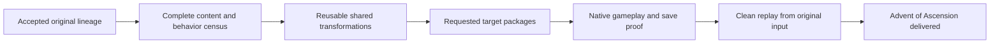

# Complete Advent of Ascension

[Home](Home.md) / [Checklist](Checklist.md) / [Architecture](Architecture.md) / [Ecosystem](Ecosystem.md) / [Source map](Source-Map.md)

> A finished original mod, not an endlessly running converter demonstration.

### Source lineage and original identity

[**AOA-01**](Checklist.md#aoa-01) - Use the accepted union of authoritative AoA source and content, retain fingerprints, mod name/public IDs and approved migrations, and continue the active project rather than choosing a smaller branch or renamed fork.

### Complete semantic port

[**AOA-02**](Checklist.md#aoa-02) - Complete every requested target's code, registries, loader APIs, networking, optional integrations and persistence through reproducible Enderloom/Dev Kit transformations.

### Complete gameplay and assets

[**AOA-03**](Checklist.md#aoa-03) - Account for all accepted items, blocks, equipment, skills, progression, dimensions, structures, mobs, bosses, AI, models, animation, audio, particles, recipes, loot and tags; no substitutes, hidden omissions or placeholders.

### Native gameplay and migration proof

[**AOA-04**](Checklist.md#aoa-04) - Exercise the full applicable client, dedicated/integrated server, unique mechanics, dimension travel, provider-present/absent and save/restart/migration inventory on the actual packaged artifact.

### Clean conversion replay

[**AOA-05**](Checklist.md#aoa-05) - Reproduce from original inputs in a fresh generated workspace, with exact dependencies, reusable fixes and equivalent-work performance; no hand-fixed target tree or developer-global tools.

### AoA delivered through the studio

[**AOA-06**](Checklist.md#aoa-06) - Ship installable complete source/mod outputs and evidence; the real AoA project opens, converts, repairs, builds, play-tests and installs safely through normal studio controls.

**[Every linked source clause](Sources-AOA.md)** / **[Source manifest](Source-Map.md)**

## Delivery sequence

AoA is not just a regression fixture. Do not substitute a smaller branch, generic mob, missing dimension, disabled subsystem, renamed fork or manually repaired output tree. Each necessary fix improves the canonical Enderloom/Dev Kit owner and gains a triggering regression. Deliver validated AoA artifacts as soon as its own gates pass while independent studio work continues; the combined assignment remains open until both outcomes pass.

## Detailed acceptance from your specifications

Every source task and binding clause has its own tracked entry, rather than disappearing into the heading above.

- [AOA-01 - Source lineage and original identity](Acceptance-AOA.md#aoa-01-details): 281 source details.
- [AOA-02 - Complete semantic port](Acceptance-AOA.md#aoa-02-details): 25 source details.
- [AOA-03 - Complete gameplay and assets](Acceptance-AOA.md#aoa-03-details): 25 source details.
- [AOA-04 - Native gameplay and migration proof](Acceptance-AOA.md#aoa-04-details): 22 source details.
- [AOA-05 - Clean conversion replay](Acceptance-AOA.md#aoa-05-details): 21 source details.
- [AOA-06 - AoA delivered through the studio](Acceptance-AOA.md#aoa-06-details): 90 source details.
