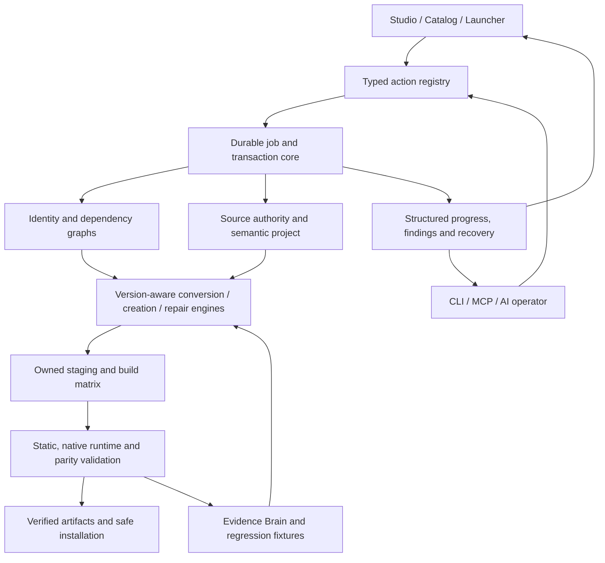
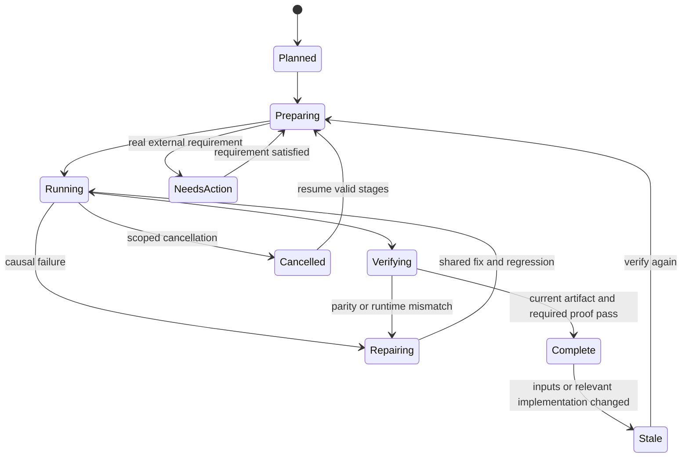

# Architecture

[Home](Home.md) / [Checklist](Checklist.md) / [Architecture](Architecture.md) / [Ecosystem](Ecosystem.md) / [Source map](Source-Map.md)

> One identity graph, one action registry, one job state, many proven engines.

## The boundaries that keep it coherent

| Owner | Owns | Must not become |
| :--- | :--- | :--- |
| Identity graph | Projects, versions, sources, mods, instances and exact artifact identity | Filename-based guesses or duplicate provider records |
| Semantic project | Source lineage, behavior, content and target transformations | A disconnected copy per version or loader |
| Action registry | Shared typed GUI/CLI/MCP/agent operations | Bypass-only agent commands or decorative buttons |
| Job core | Staging, cancellation, retry, fingerprints and recovery | A fresh task after every restart or duplicate worker writes |
| Evidence graph | Inputs, artifacts, scenarios, observations and proof freshness | Model confidence or unchecked upstream assertions |
| Tool adapters | Pair-specific capabilities and tested library/CLI calls | The product's version ceiling or a user-facing tool maze |

## Honest state transitions

Cancellation, failed downloads and inaccessible hosts never mean success or absence. Partial and staged outputs stay separate from certified artifacts. A completed symbol mapping is not a completed semantic port.
