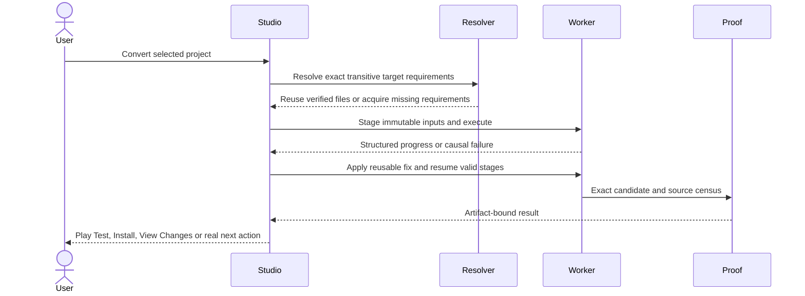

# Dependencies and shared operations

[Home](Home.md) / [Checklist](Checklist.md) / [Architecture](Architecture.md) / [Ecosystem](Ecosystem.md) / [Source map](Source-Map.md)

> The app finds the requirements and resumes the original job.

### Full dependency closure

[**DEP-01**](Checklist.md#dep-01) - Resolve source/target/transitive/nested/build/runtime/client/server and optional dependencies together, preserving ranges, provider identity, hashes and semantic target-side equivalents.

### Automatic safe acquisition

[**DEP-02**](Checklist.md#dep-02) - Fetch ordinary compatible requirements through authorized routes, verify complete bytes, resume interrupted downloads and original jobs; explain provider challenges without bypassing them.

### Conflict and change-impact graph

[**DEP-03**](Checklist.md#dep-03) - Explain diamonds/cycles/conflicts, dependents, world/config/benchmark impact and why a component is installed; no arbitrary replacement, constraint relaxation or silent dependency deletion.

### Managed immutable toolchains

[**DEP-04**](Checklist.md#dep-04) - Provision versioned JDKs/Gradle/loaders/tools, single-flight shared downloads and fingerprints, isolate tool versus game runtimes and reuse verified offline cache without developer-global assumptions.

### Canonical identity and action registry

[**DEP-05**](Checklist.md#dep-05) - GUI/CLI/MCP/agents share stable project/artifact/instance/provider identities and typed operations, with no private bypass or duplicate resolver/state owner.

### Staged transactions and concurrent safety

[**DEP-06**](Checklist.md#dep-06) - Use immutable inputs, owned staging, revision/hash guards, atomic promotion, scoped rollback and late-worker rejection; preserve external files and concurrent Codex/user edits.

### Durable jobs and cancellation

[**DEP-07**](Checklist.md#dep-07) - Persist operation/process identities, completed-stage fingerprints, logs, retries and exact next action across restart; cancel only owned work and never promote partial outputs.

### Adapter proof and truthful failures

[**DEP-08**](Checklist.md#dep-08) - Probe actual CLI/library contracts and pair-specific fixtures; reject exit-zero/no-output/stale/malformed reports, distinguish unknown from absent and route failed backends to real recovery.

**[Every linked source clause](Sources-DEP.md)** / **[Source manifest](Source-Map.md)**

## A download or build failure must not lose the job

**QoL connections:** duplicate clicks attach to the same job; a lost connection preserves the selected dependency and continues after legitimate reconnect; changed source invalidates only dependent results; a crash leaves the original project and world untouched. These are connected scenarios for existing requirements, not new permission to bypass access controls or silently change intent.
