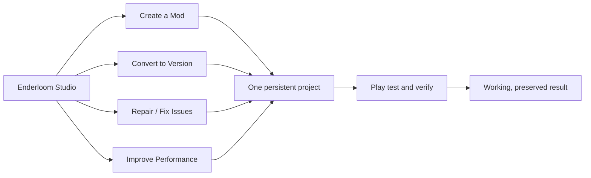

# Enderloom Studio

[Home](Home.md) / [Checklist](Checklist.md) / [Architecture](Architecture.md) / [Ecosystem](Ecosystem.md) / [Source map](Source-Map.md)

> Create beautifully. Convert confidently. Repair intelligently. Lose nothing.

### One studio. Four clear beginnings. Two immediate outcomes.

**[Complete Advent of Ascension](Advent-of-Ascension.md) &nbsp; | &nbsp; [Ship the beautiful studio](Studio.md)**

## Preserve the catalogue and browser

**[Ad-free mod images](Media-Integrity.md) / [Site adapters](Site-Adapters.md) / [Browser and translation](Browser-and-Translation.md) / [Detailed source checklist](Detailed-Acceptance.md)**

## Choose your destination

| Workstream | What you can find |
| :--- | :--- |
| **[Complete Advent of Ascension](Advent-of-Ascension.md)** | A finished original mod, not an endlessly running converter demonstration. |
| **[Beautiful unified studio](Studio.md)** | Welcoming on the surface; professional depth one click away. |
| **[Authoring and real assets](Creation-and-Assets.md)** | Visual creation and expert code operate on the same editable project. |
| **[Universal conversion engine](Conversion.md)** | One semantic project; the strongest proven backend for each real target. |
| **[Dependencies and shared operations](Dependencies-and-Recovery.md)** | The app finds the requirements and resumes the original job. |
| **[Repair and forensics](Repair-and-Diagnostics.md)** | Fix the causal owner, retain content, and prove the repaired result. |
| **[Native testing and control plane](Testing-and-Proof.md)** | Cheap decisive checks during iteration; strongest required proof at certification. |
| **[Performance without loss](Performance.md)** | Optimize measured work, not the amount of content or verification. |
| **[Discovery, favorites and content](Library-and-Discovery.md)** | Research a project, act on it, and return to its evidence without losing context. |
| **[Launcher, accounts and instances](Launcher-and-Instances.md)** | Keep the existing launcher and catalogue working while the studio grows. |
| **[Configuration, hotkeys and progression](Configuration-and-Hotkeys.md)** | Turn obscure settings and conflicts into clear, reversible actions. |
| **[Worlds, servers and migration](Worlds-and-Servers.md)** | Preserve Forever Worlds, external ownership and every meaningful migration field. |
| **[AI operator and evidence brain](AI-and-Evidence.md)** | One job and one evidence model, regardless of who drives the interface. |
| **[Knowledge and compatibility](Knowledge-and-Compatibility.md)** | Explanations and documentation connect directly to the working project. |
| **[Security, preservation and release](Quality-and-Release.md)** | A fast result is only a win when the entire intended result survives. |

## A checklist that cannot hide the details

**118 canonical outcome owners** connect **47 located source documents** and **10,569 distinct source blocks**. Requirement-level checklists expose their full source details. Exact repeated occurrences share a source record; related specifications point to the same outcome rather than creating another progress checkbox. All original detailed clauses stay available through the [Source map](Source-Map.md).

> [!NOTE]
> Older specifications contain **235 checked task occurrences**. These remain recorded as historical source claims, not freshly verified app functionality. Current evidence and checkmarks are maintained in [one requirements ledger](requirements.json); this documentation build does not certify AoA or the application.

## Fast at the loss of nothing

Optimize duplicate work through shared services, verified caching, incremental invalidation and bounded concurrency. Keep full datasets, original content, native fidelity and required verification. **A faster incomplete result is a failed result.**

Use approachable controls and contextual depth, not a text-wall interface or twenty engine-specific toolbars. Ordinary setup and recovery belong to the app; sensitive authorization and destructive choices remain under user control.

**[Start or continue implementation](Working-Agreement.md)** / **[All source references](Reference-Index.md)** / **[Repository](https://github.com/Herbertofury/Enderloom)** / **[Releases](https://github.com/Herbertofury/Enderloom/releases)**
