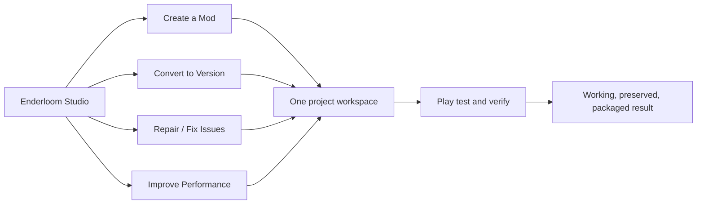
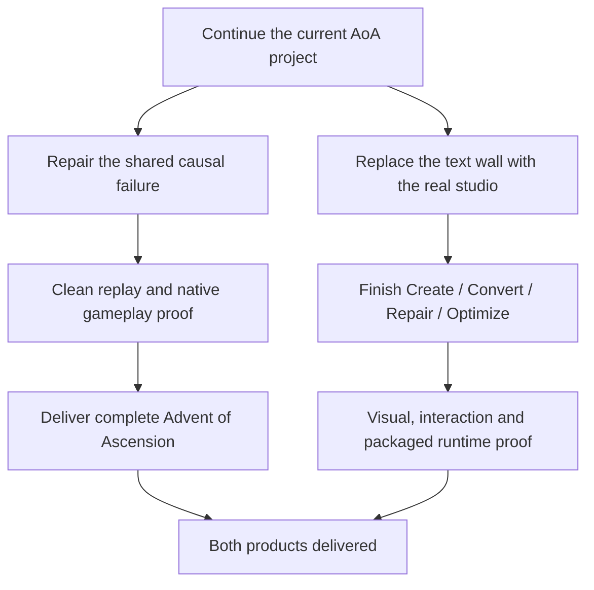

# Enderloom Studio
### Create beautifully. Convert confidently. Repair intelligently. Lose nothing.

**[Execution checklist](Checklist.md) · [Studio experience](Studio.md) · [Architecture](Architecture.md) · [Ecosystem](Ecosystem.md) · [Source map](Source-Map.md)**

> [!IMPORTANT]
> Two product outcomes lead this workspace: **complete Advent of Ascension** and **ship the complete, approachable Enderloom Studio**. Documentation progress is not product completion. Every checked requirement needs implementation and relevant verification evidence.

## Start here

| Your destination | What belongs there |
| :--- | :--- |
| **[Execution checklist](Checklist.md)** | One canonical progress owner per capability, with original specification details connected rather than copied into competing backlogs. |
| **[Advent of Ascension](Advent-of-Ascension.md)** | Original identity, full accepted content, every requested target, clean conversion replay and real gameplay proof. |
| **[Studio experience](Studio.md)** | Four welcoming actions, a real visual workbench, contextual tools, reliable undo and effortless continuation. |
| **[Architecture](Architecture.md)** | How discovery, projects, conversion, diagnostics, dependencies, testing and release share the same services. |
| **[Ecosystem](Ecosystem.md)** | Source-linked projects to integrate, compare or learn from, with their roles and rights kept distinct. |
| **[Source map](Source-Map.md)** | Specification provenance, original task aliases, exact-source fingerprints and coverage accounting. |
| **[Working agreement](Working-Agreement.md)** | How Codex updates progress without inventing success, losing scope or creating another parallel checklist. |

## One product, four clear beginnings

## The product promise

**Fast at the loss of nothing.** Reduce duplicate work, not content. Cache valid results, not false assumptions. Keep expensive work off the interface thread, retain full logical datasets and full-resolution source media, and measure performance on equivalent workloads. Preserve models, animations, gameplay, compatibility, saves, source identity and verification.

**Power without intimidation.** The default screen contains visual projects and clear actions, not raw logs, JSON or instructions. Advanced source, evidence and diagnostics remain a click away. Every control performs the real operation through the shared service layer.

**Ordinary recovery belongs to the application.** Enderloom detects inputs, installs ordinary missing dependencies, stages changes safely, repairs causal failures, remembers useful choices and resumes the exact job after interruption. Sensitive authorization and destructive choices remain under user control.

## Priority path

The current [complete Studio execution brief](https://drive.google.com/file/d/1v0_F0BW_QPoro7gxnyYXVhbVhdqIajBd/view) and [Northpoint contract](../ENDERLOOM_NORTHPOINT_UNIVERSAL_VERSION_MATRIX_HANDOFF.md) remain source authorities. Their detailed requirements are not replaced by this landing page.

---

**[Repository](https://github.com/Herbertofury/Enderloom) · [Issues](https://github.com/Herbertofury/Enderloom/issues) · [Releases](https://github.com/Herbertofury/Enderloom/releases)**
