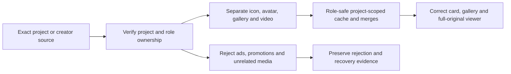

# Ad-free mod images and exact media identity

[Home](Home.md) / [Checklist](Checklist.md) / [Architecture](Architecture.md) / [Ecosystem](Ecosystem.md) / [Source map](Source-Map.md)

> Advertisements are not mod images. Browser ad blocking and gallery ownership are separate requirements; both must work.

**[Canonical outcome LIB-02](Checklist.md#lib-02)** / **[Full media acceptance](Acceptance-LIB.md#lib-02-details)**

## What must never enter a mod gallery

Reject global promotions, ads, campaign and contest art, sponsor media, tier frames, unrelated sibling submissions, commenter avatars and site chrome. Bind accepted project art to the exact project, creator avatars to the exact creator/profile, and gallery/post/video media to the correct owned content region. A plausible CDN hostname or the first image on the page is not ownership evidence.

Keep project icon, creator avatar, gallery image, post media, GIF/video and poster roles separate through extraction, caching, main-process merging and renderer merging. Quarantine ambiguous collisions rather than painting the same URL in incompatible roles. Retain legitimate full-resolution originals and all project-owned gallery entries; filtering must not become a gallery cap.

## The hard cases are requirements, not optional polish

| Source-defined case | Required result |
| :--- | :--- |
| CurseForge Description / Comments / Files / Gallery / Relations navigation | Navigation must not cut the exact gallery before its attachment cards. |
| Lazy image placeholder wrapped by a real attachment link | Recover the authoritative full image, not the placeholder. |
| Empty Gallery tab | Record source-scoped absence and continue canonical Description/post discovery; do not declare the entire project media-free. |
| Icon and creator avatar cached, gallery unresolved | Continue gallery discovery; an icon is not a complete media result. |
| Real media arrives after a negative cache entry | Clear the stale absence and update the card. |
| Planet Minecraft creator/profile and More-by siblings | Keep the creator avatar separate; exclude comments, update-log pollution and sibling submissions. |
| AFDIAN vm-pic / img-pre and styled/structured post media | Preserve typed post media and original CDN resolution; keep transformed/watermarked previews distinct. |
| Several cards share one creator/index URL | Share physical requests without merging project identities or blocking first image on avatar enrichment. |
| Premium trailer preview | Exact-project legitimate media; one autoplay owner, muted start, viewport/focus/background cancellation, preferences and gallery fallback. |

These contracts come from the original specifications and documented behavior below. The documentation update does not assert that their application runtime tests have passed.

## Exact source requirements and regression history

- [D-9bb70e2ecbd4c7cf5dab](Acceptance-LIB.md#d-9bb70e2ecbd4c7cf5dab) - - Fixes the persistent Bok&#x27;s Banging Butterflies failure exposed by the native Windows 2.9.4 test instead of treating the earlier fixture as proof. - Mirrors CurseForge&#x27;s...
- [D-dbca50c3311f9022716a](Acceptance-LIB.md#d-dbca50c3311f9022716a) - - Fixes the remaining real Windows failure where CurseForge&#x27;s project Gallery tab could be present and contain media while bounded HTTP/stream probes still returned no ga...
- [D-bde9ee239133fffe5f74](Acceptance-LIB.md#d-bde9ee239133fffe5f74) - - Recovers modern CurseForge gallery media when the authoritative full ForgeCDN/CurseCDN attachment is exposed by the wrapping link while the nested image is still a lazy...
- [D-29b4af91f88c01bc09a7](Acceptance-LIB.md#d-29b4af91f88c01bc09a7) - - Fixes the remaining cross-role contamination path. Project icon, creator avatar and gallery media are now separate semantic lanes all the way through provider parsing, ...
- [D-562c93c0d756e68a2411](Acceptance-LIB.md#d-562c93c0d756e68a2411) - - Promotes the live-media pipeline from a CurseForge-heavy optimizer to a 23-family provider capability registry covering CurseForge, Modrinth, GitHub, GitLab, Hangar, Sp...
- [D-03c1b12e2bb61921f44c](Acceptance-LIB.md#d-03c1b12e2bb61921f44c) - - Fixes a hidden cross-session performance bug: the catalog renderer now uses the same persistent Chromium session partition as live discovery. Provider preconnect, DNS/T...
- [D-a8e9e06a8d58e46f4bf0](Acceptance-LIB.md#d-a8e9e06a8d58e46f4bf0) - - Replaces the last arbitrary byte-threshold wait in first-image discovery with a content-sensitive media gate. Node, Chromium, and native Rust now resolve a dedicated me...
- [D-20bec01ef39065303791](Acceptance-LIB.md#d-20bec01ef39065303791) - - Replaces the remaining WAF-sensitive single-transport bottleneck with three real simultaneous network engines per exact provider page: pooled Node core HTTP, Electron s...
- [D-3b306e7e0c82babf834b](Acceptance-LIB.md#d-3b306e7e0c82babf834b) - - Fixes the remaining catalog-wide first-paint stall at the scheduler boundary. Prime requests are now sorted in the renderer, admitted to the main-process queue as one a...
- [D-68e7a159c33a4e1482cb](Acceptance-LIB.md#d-68e7a159c33a4e1482cb) - - Extends the 2.0.11 progressive first-image frontier with Modrinth&#x27;s official bulk GET /projects?ids=[…] endpoint. Every unique Modrinth project in the catalog is primed...
- [D-b997a8b23ebc9c8d3366](Acceptance-LIB.md#d-b997a8b23ebc9c8d3366) - - Fixes the largest warm-start media bug: persistent discovery cache is now keyed by source URL + exact project identity, so multiple catalog entries that share a Planet ...
- [D-ea91201c424db30996c7](Acceptance-LIB.md#d-ea91201c424db30996c7) - - Back / forward / reload-stop / address search - New, close, and reopen browser tabs - Persistent live-site cookies and sessions - Find in page and zoom - Visible downlo...
- [D-895b6776066946db7400](Acceptance-LIB.md#d-895b6776066946db7400) - Premium Steam-like mod trailer autoplay: real trailers can automatically preview in Catalog/mod-detail browsing for Premium users under the media rules in Phase D. [DEC-016]
- [D-c8f17613313ec8f2c3c6](Acceptance-LIB.md#d-c8f17613313ec8f2c3c6) - Media identity: trailer/video assets carry exact project/provider/source provenance and never borrow unrelated creator/sibling/promotional video. [PD-010]
- [D-6f03e494c345d2d6d370](Acceptance-LIB.md#d-6f03e494c345d2d6d370) - Supported sources: use real project-author/provider/user-supplied trailers or videos that Enderloom is legitimately allowed to display/stream; no synthetic replacement tr... [PD-011]
- [D-15985491384fd7ab3c30](Acceptance-LIB.md#d-15985491384fd7ab3c30) - Catalog autoplay: Premium users can enable Steam-like muted trailer preview on stable hover/focus/dwell over a mod card; only one card autoplay session is active at once. [PD-012]
- [D-bbe8d23311ea75898de1](Acceptance-LIB.md#d-bbe8d23311ea75898de1) - Detail autoplay: Premium mod-detail pages can automatically transition the hero media area from poster/gallery to the highest-priority legitimate trailer according to use... [PD-013]
- [D-48ffa514cbe00227428b](Acceptance-LIB.md#d-48ffa514cbe00227428b) - Playback lifecycle: pause/stop when card leaves viewport, focus moves away, tab/app backgrounds, user scrolls away, or another trailer takes ownership. [PD-014]
- [D-f4a0b024c4fa41b6414d](Acceptance-LIB.md#d-f4a0b024c4fa41b6414d) - Audio: autoplay starts muted; audio requires explicit user action. Remember mute/volume preference only when appropriate and never surprise-play audio. [PD-015]
- [D-2b6a0f503c2032ab4a28](Acceptance-LIB.md#d-2b6a0f503c2032ab4a28) - User controls: global Premium autoplay toggle plus per-context preference (Catalog hover, detail hero) and reduced-data/network-sensitive behavior. [PD-016]
- [D-7b186958937e18626ea4](Acceptance-LIB.md#d-7b186958937e18626ea4) - Accessibility: honor reduced-motion/autoplay preference, keyboard focus behavior, screen-reader semantics, captions/subtitles when the source exposes them, and a visible ... [PD-017]
- [D-f2af60e82fc6696f4024](Acceptance-LIB.md#d-f2af60e82fc6696f4024) - Bandwidth/performance: preload poster/metadata first; defer video bytes until likely playback; bound concurrent buffering; cancel abandoned requests; do not make large ca... [PD-018]
- [D-d02dbf4c5c2c6a77488c](Acceptance-LIB.md#d-d02dbf4c5c2c6a77488c) - Caching/rights: cache/stream only as provider terms and source permissions allow; otherwise use legitimate embedded/remote playback without exporting cookies or bypassing... [PD-019]
- [D-1a3a5f1cf9e35409e8f7](Acceptance-LIB.md#d-1a3a5f1cf9e35409e8f7) - Fallback: if no valid trailer exists, remain on real screenshots/gallery art. Never generate a fake trailer, mislabeled slideshow, or unrelated video. [PD-020]
- [D-9a96a2ff9e1680082680](Acceptance-LIB.md#d-9a96a2ff9e1680082680) - Testing: verify hover/focus ownership, pause/resume, muted autoplay, network cancellation, reduced-motion/data modes, provider login state, card virtualization, and no pl... [PD-021]
- [D-382fae60240d768781c8](Acceptance-LIB.md#d-382fae60240d768781c8) - Premium trailer browsing: PD-010..021 across a catalog containing cards with valid trailers, missing trailers, login-sensitive media, reduced-motion mode and rapid naviga... [GX-15]
- [D-7118ec35e90ac551ae9e](Acceptance-LIB.md#d-7118ec35e90ac551ae9e) - Quarantine ambiguous media-role collisions.
- [D-3372fee16ff9aeca5549](Acceptance-LIB.md#d-3372fee16ff9aeca5549) - Reject global promotions, ads, campaign art, unrelated sibling submissions, commenter avatars, etc.

[Browser ad-filtering requirements](Browser-and-Translation.md) / [All named site adapters](Site-Adapters.md)
