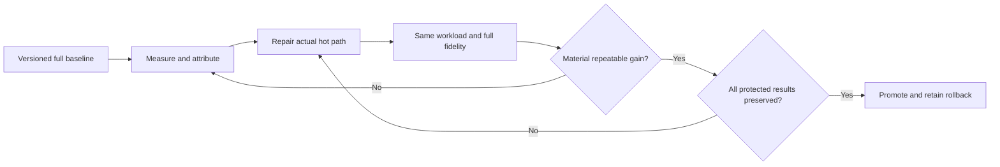

# Performance without loss

[Home](Home.md) / [Checklist](Checklist.md) / [Architecture](Architecture.md) / [Ecosystem](Ecosystem.md) / [Source map](Source-Map.md)

> Optimize measured work, not the amount of content or verification.

### Real mod and instance optimization

[**PERF-01**](Checklist.md#perf-01) - Profile and repair dominant CPU/tick/render/worldgen/memory/I/O costs, apply reversible changes and retest; recommendations alone do not count as Optimize.

### Minimal measurement and rich attribution

[**PERF-02**](Checklist.md#perf-02) - Separate low-overhead measurements from diagnostic runs; integrate native telemetry/JFR/spark/Observable/probes and correlate causality without misreporting overhead as mod cost.

### Controlled A/B and full-pack attribution

[**PERF-03**](Checklist.md#perf-03) - Use equivalent fingerprints, dependency-safe with/without plans, repeated samples, variance/confidence and stale-baseline detection; static risk is not measured causality.

### Frame-time and GPU lab

[**PERF-04**](Checklist.md#perf-04) - Measure distributions/stutters/render-thread/GPU behavior in real native scenarios; fix hot paths without reducing visual fidelity, shaders, distance, geometry or animation cadence.

### Boot and fast-launch engine

[**PERF-05**](Checklist.md#perf-05) - Reuse verified immutable setup and classpath/toolchain/asset caches, profile startup phases and preserve full required initialization; no fake faster launch by skipping work.

### Memory, tick and throughput gains

[**PERF-06**](Checklist.md#perf-06) - Report allocation/GC/memory/MSPT/TPS/load/throughput as relevant, repair regressions and show per-lane results instead of averages hiding loss.

### Fast conversion and responsive studio

[**PERF-07**](Checklist.md#perf-07) - Single-flight/index/cache/batch/diff-aware workers improve first useful result and end-to-end latency with bounded resources; meet measured local UI budgets without reduced result sets.

### Dedicated Performance workspace

[**PERF-08**](Checklist.md#perf-08) - Provide understandable before/after charts, conditions, bottlenecks, scenario control, drill-down and exact optimize/rollback actions in the dedicated first-class surface.

### Dual quality and speed acceptance

[**PERF-09**](Checklist.md#perf-09) - Demonstrate material repeatable improvement on required fixtures and preservation of full content/correctness/compatibility/verification; repair mixed regressions and never invent gains for already-optimal cases.

**[Every linked source clause](Sources-PERF.md)** / **[Source manifest](Source-Map.md)**

## Dual-success contract

Keep world/scenario, entity population, features, draw/simulation distances, shaders, geometry, texture detail, AI/animation cadence, test coverage and output completeness constant. Separate a quick static risk signal from measured causality, and low-overhead measurement from intrusive attribution. Show sample size, spread, cold/warm conditions and per-lane regressions. Do not hide a slower lane in an average or manufacture a speedup by shortening the test.

The selected mod/instance and Enderloom's own conversion pipeline are separate optimization targets. Both matter. A flat already-optimal test case may honestly show no gain, but required improvement fixtures cannot be waived.

## Detailed acceptance from your specifications

Every source task and binding clause has its own tracked entry, rather than disappearing into the heading above.

- [PERF-01 - Real mod and instance optimization](Acceptance-PERF.md#perf-01-details): 89 source details.
- [PERF-02 - Minimal measurement and rich attribution](Acceptance-PERF.md#perf-02-details): 26 source details.
- [PERF-03 - Controlled A/B and full-pack attribution](Acceptance-PERF.md#perf-03-details): 33 source details.
- [PERF-04 - Frame-time and GPU lab](Acceptance-PERF.md#perf-04-details): 78 source details.
- [PERF-05 - Boot and fast-launch engine](Acceptance-PERF.md#perf-05-details): 7 source details.
- [PERF-06 - Memory, tick and throughput gains](Acceptance-PERF.md#perf-06-details): 28 source details.
- [PERF-07 - Fast conversion and responsive studio](Acceptance-PERF.md#perf-07-details): 8 source details.
- [PERF-08 - Dedicated Performance workspace](Acceptance-PERF.md#perf-08-details): 74 source details.
- [PERF-09 - Dual quality and speed acceptance](Acceptance-PERF.md#perf-09-details): 9 source details.
