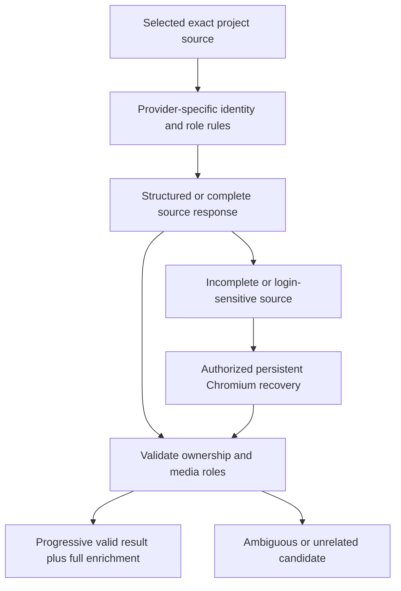

# Site adapters and source-owned extraction

[Home](Home.md) / [Checklist](Checklist.md) / [Architecture](Architecture.md) / [Ecosystem](Ecosystem.md) / [Source map](Source-Map.md)

> Keep the entire specified provider universe. A generic scraper or a site name alone does not prove a working adapter.

**[Canonical outcome LIB-01](Checklist.md#lib-01)** / **[Source acceptance](Acceptance-LIB.md#lib-01-details)** / **[Media safety](Media-Integrity.md)**

## Shared contract, provider-specific knowledge

Use provider-specific adapters where justified, retaining an identity-checked fallback for unknown exact project pages. Keep exact project/source identity, creator/profile knowledge, semantic media roles and legitimate persistent-session access connected. Preserve known full-HTML, streaming and Chromium DOM recovery paths without accepting unrelated page assets. Do not turn an access failure or incomplete scrape into an empty catalogue or successful extraction.

Each provider below is independently traceable and checkable. Its named-family requirement inherits the shared source contract; it does not invent a new API or certify every page type. The original full details remain attached.

| Specified provider family | Individual acceptance | Source |
| :--- | :--- | :--- |
| **CurseForge** | [SITE-curseforge](Acceptance-LIB.md#site-curseforge) | [ENDERLOOM_MASTER_REQUIREMENTS.md : 152-152](https://github.com/Herbertofury/Enderloom/blob/main/docs/ENDERLOOM_MASTER_REQUIREMENTS.md#L152-L152) |
| **Modrinth** | [SITE-modrinth](Acceptance-LIB.md#site-modrinth) | [ENDERLOOM_MASTER_REQUIREMENTS.md : 153-153](https://github.com/Herbertofury/Enderloom/blob/main/docs/ENDERLOOM_MASTER_REQUIREMENTS.md#L153-L153) |
| **GitHub** | [SITE-github](Acceptance-LIB.md#site-github) | [ENDERLOOM_MASTER_REQUIREMENTS.md : 154-154](https://github.com/Herbertofury/Enderloom/blob/main/docs/ENDERLOOM_MASTER_REQUIREMENTS.md#L154-L154) |
| **GitLab** | [SITE-gitlab](Acceptance-LIB.md#site-gitlab) | [ENDERLOOM_MASTER_REQUIREMENTS.md : 155-155](https://github.com/Herbertofury/Enderloom/blob/main/docs/ENDERLOOM_MASTER_REQUIREMENTS.md#L155-L155) |
| **Hangar** | [SITE-hangar](Acceptance-LIB.md#site-hangar) | [ENDERLOOM_MASTER_REQUIREMENTS.md : 156-156](https://github.com/Herbertofury/Enderloom/blob/main/docs/ENDERLOOM_MASTER_REQUIREMENTS.md#L156-L156) |
| **SpigotMC** | [SITE-spigotmc](Acceptance-LIB.md#site-spigotmc) | [ENDERLOOM_MASTER_REQUIREMENTS.md : 157-157](https://github.com/Herbertofury/Enderloom/blob/main/docs/ENDERLOOM_MASTER_REQUIREMENTS.md#L157-L157) |
| **Bukkit** | [SITE-bukkit](Acceptance-LIB.md#site-bukkit) | [ENDERLOOM_MASTER_REQUIREMENTS.md : 158-158](https://github.com/Herbertofury/Enderloom/blob/main/docs/ENDERLOOM_MASTER_REQUIREMENTS.md#L158-L158) |
| **BuiltByBit** | [SITE-builtbybit](Acceptance-LIB.md#site-builtbybit) | [ENDERLOOM_MASTER_REQUIREMENTS.md : 159-159](https://github.com/Herbertofury/Enderloom/blob/main/docs/ENDERLOOM_MASTER_REQUIREMENTS.md#L159-L159) |
| **Nexus Mods** | [SITE-nexus-mods](Acceptance-LIB.md#site-nexus-mods) | [ENDERLOOM_MASTER_REQUIREMENTS.md : 160-160](https://github.com/Herbertofury/Enderloom/blob/main/docs/ENDERLOOM_MASTER_REQUIREMENTS.md#L160-L160) |
| **ModDB** | [SITE-moddb](Acceptance-LIB.md#site-moddb) | [ENDERLOOM_MASTER_REQUIREMENTS.md : 161-161](https://github.com/Herbertofury/Enderloom/blob/main/docs/ENDERLOOM_MASTER_REQUIREMENTS.md#L161-L161) |
| **Polymart** | [SITE-polymart](Acceptance-LIB.md#site-polymart) | [ENDERLOOM_MASTER_REQUIREMENTS.md : 162-162](https://github.com/Herbertofury/Enderloom/blob/main/docs/ENDERLOOM_MASTER_REQUIREMENTS.md#L162-L162) |
| **Planet Minecraft** | [SITE-planet-minecraft](Acceptance-LIB.md#site-planet-minecraft) | [ENDERLOOM_MASTER_REQUIREMENTS.md : 163-163](https://github.com/Herbertofury/Enderloom/blob/main/docs/ENDERLOOM_MASTER_REQUIREMENTS.md#L163-L163) |
| **MCPEDL** | [SITE-mcpedl](Acceptance-LIB.md#site-mcpedl) | [ENDERLOOM_MASTER_REQUIREMENTS.md : 164-164](https://github.com/Herbertofury/Enderloom/blob/main/docs/ENDERLOOM_MASTER_REQUIREMENTS.md#L164-L164) |
| **ModBay** | [SITE-modbay](Acceptance-LIB.md#site-modbay) | [ENDERLOOM_MASTER_REQUIREMENTS.md : 165-165](https://github.com/Herbertofury/Enderloom/blob/main/docs/ENDERLOOM_MASTER_REQUIREMENTS.md#L165-L165) |
| **AFDIAN** | [SITE-afdian](Acceptance-LIB.md#site-afdian) | [ENDERLOOM_MASTER_REQUIREMENTS.md : 166-166](https://github.com/Herbertofury/Enderloom/blob/main/docs/ENDERLOOM_MASTER_REQUIREMENTS.md#L166-L166) |
| **Patreon** | [SITE-patreon](Acceptance-LIB.md#site-patreon) | [ENDERLOOM_MASTER_REQUIREMENTS.md : 167-167](https://github.com/Herbertofury/Enderloom/blob/main/docs/ENDERLOOM_MASTER_REQUIREMENTS.md#L167-L167) |
| **Minecraft Marketplace** | [SITE-minecraft-marketplace](Acceptance-LIB.md#site-minecraft-marketplace) | [ENDERLOOM_MASTER_REQUIREMENTS.md : 168-168](https://github.com/Herbertofury/Enderloom/blob/main/docs/ENDERLOOM_MASTER_REQUIREMENTS.md#L168-L168) |
| **BOOTH** | [SITE-booth](Acceptance-LIB.md#site-booth) | [ENDERLOOM_MASTER_REQUIREMENTS.md : 169-169](https://github.com/Herbertofury/Enderloom/blob/main/docs/ENDERLOOM_MASTER_REQUIREMENTS.md#L169-L169) |
| **Fourthwall** | [SITE-fourthwall](Acceptance-LIB.md#site-fourthwall) | [ENDERLOOM_MASTER_REQUIREMENTS.md : 170-170](https://github.com/Herbertofury/Enderloom/blob/main/docs/ENDERLOOM_MASTER_REQUIREMENTS.md#L170-L170) |
| **Ko-fi** | [SITE-ko-fi](Acceptance-LIB.md#site-ko-fi) | [ENDERLOOM_MASTER_REQUIREMENTS.md : 171-171](https://github.com/Herbertofury/Enderloom/blob/main/docs/ENDERLOOM_MASTER_REQUIREMENTS.md#L171-L171) |
| **itch.io** | [SITE-itch-io](Acceptance-LIB.md#site-itch-io) | [ENDERLOOM_MASTER_REQUIREMENTS.md : 172-172](https://github.com/Herbertofury/Enderloom/blob/main/docs/ENDERLOOM_MASTER_REQUIREMENTS.md#L172-L172) |
| **Gumroad** | [SITE-gumroad](Acceptance-LIB.md#site-gumroad) | [ENDERLOOM_MASTER_REQUIREMENTS.md : 173-173](https://github.com/Herbertofury/Enderloom/blob/main/docs/ENDERLOOM_MASTER_REQUIREMENTS.md#L173-L173) |
| **alltheysm** | [SITE-alltheysm](Acceptance-LIB.md#site-alltheysm) | [ENDERLOOM_MASTER_REQUIREMENTS.md : 174-174](https://github.com/Herbertofury/Enderloom/blob/main/docs/ENDERLOOM_MASTER_REQUIREMENTS.md#L174-L174) |

## Recovery without losing content or speed

Preserve creator enrichment off the first-image critical path, full uncapped galleries, full-resolution originals, project-scoped cache identity, single-flight requests and source-aware negative-cache recovery. A speed improvement must not substitute ads, omit gallery items or collapse different projects sharing an index page.

## Detailed source clauses

- [D-587120a79458adfbd02c](Acceptance-LIB.md#d-587120a79458adfbd02c) - - Extends creator-avatar ownership beyond CurseForge. Planet Minecraft now binds the exact /member/&lt;creator&gt;/ link and its adjacent/member avatar on the project page when...
- [D-f26b82b63850a981687b](Acceptance-LIB.md#d-f26b82b63850a981687b) - - Fixes the obvious wrong-image failure shown on CurseForge cards: streamed /gallery discovery no longer trusts the first ForgeCDN-looking URL on a page. The fast path no...
- [D-cf160be110ef5f198989](Acceptance-LIB.md#d-cf160be110ef5f198989) - - Drop supported files anywhere on the desktop app or use Catalogs, sources &amp; sync -&gt; Import local files. - Smart ingest treats structured data as the row authority and k...
- [D-1f462dfd1387baba7fd1](Acceptance-LIB.md#d-1f462dfd1387baba7fd1) - Run full release gates before install.
- [D-b94ea0f812c1f07f84b6](Acceptance-LIB.md#d-b94ea0f812c1f07f84b6) - Version-sensitive APIs/ecosystems are revalidated just-in-time from current primary sources. [REF-003]
- [D-164c10d0b7394e4140c5](Acceptance-LIB.md#d-164c10d0b7394e4140c5) - External launcher integration: CurseForge/Modrinth discovery, connect-in-place, physical-path/junction identity, explicit clone/copy, safe disconnect/reconciliation. [P0-012]
- [D-35dbd082483a9ac7fd74](Acceptance-LIB.md#d-35dbd082483a9ac7fd74) - identity/version/hash/provider/source/install locations. [PA-040]
- [D-ce0e24c275a1542768bd](Acceptance-LIB.md#d-ce0e24c275a1542768bd) - machine options: JSON/JSONL, quiet/verbose/no-color, non-interactive/yes, timeout, trace ID, output, plan/dry-run, stable exit codes, stdout/stderr discipline, schema/ver... [PC-003]
- [D-081834ba59340525ee57](Acceptance-LIB.md#d-081834ba59340525ee57) - Detect broad home/profile/browser/session/Discord/token path access patterns.
- [D-04750a5d1430d5302e84](Acceptance-LIB.md#d-04750a5d1430d5302e84) - old Windows/UWP development-folder discovery only when user points Enderloom at legitimate local content.
- [D-d6ed79500bd6c53df16d](Acceptance-LIB.md#d-d6ed79500bd6c53df16d) - Record source/provider/license/permission where known.
- [D-96e3a0cfbabfd0c3e840](Acceptance-LIB.md#d-96e3a0cfbabfd0c3e840) - · Make update discovery and Update All feel instant [T002]
- [D-828742cb69bccebbcad6](Acceptance-LIB.md#d-828742cb69bccebbcad6) - A logical mod/project appearing on multiple providers must show as one canonical favorite card with provider badges/source options, matching the rest of Enderloom&#x27;s cross...
- [D-0cafc4fc4d4c19e94ca2](Acceptance-LIB.md#d-0cafc4fc4d4c19e94ca2) - Exact project/source links.
- [D-484306048f65a7aa2d22](Acceptance-LIB.md#d-484306048f65a7aa2d22) - Source health / refresh behavior.
- [D-e5240a891601b8ce27d1](Acceptance-LIB.md#d-e5240a891601b8ce27d1) - Enderloom&#x27;s research/media architecture must remain broad and provider-aware rather than CurseForge-only.
- [D-dc8eea616e508365b1da](Acceptance-LIB.md#d-dc8eea616e508365b1da) - First-class provider families already established include:
- [D-d6816cd3dbff7393a341](Acceptance-LIB.md#d-d6816cd3dbff7393a341) - - CurseForge - Modrinth - GitHub - GitLab - Hangar - SpigotMC - Bukkit - BuiltByBit - Nexus Mods - ModDB - Polymart - Planet Minecraft - MCPEDL - ModBay - AFDIAN - Patreo...
- [D-671ff1f45f2cac47e856](Acceptance-LIB.md#d-671ff1f45f2cac47e856) - Requirements:
- [D-9b8bf0e9f75d84be27db](Acceptance-LIB.md#d-9b8bf0e9f75d84be27db) - Exact-project identity boundaries.
- [D-b386d8eb92accd4883c9](Acceptance-LIB.md#d-b386d8eb92accd4883c9) - Use provider-specific adapters when justified.
- [D-3f7cd31a445428e89111](Acceptance-LIB.md#d-3f7cd31a445428e89111) - Preserve generic identity-checked fallback for unknown exact project pages.
- [D-8e670265e0b8c69f845f](Acceptance-LIB.md#d-8e670265e0b8c69f845f) - Login-sensitive/private providers use the real persistent Chromium session rather than exporting cookies or bypassing access controls.
- [D-12e1b68d5106cddc1975](Acceptance-LIB.md#d-12e1b68d5106cddc1975) - Discover usable Modrinth profiles.
- [D-8f5b59b09fc00e810868](Acceptance-LIB.md#d-8f5b59b09fc00e810868) - Invalid/unavailable external instances remain untouched.
- [D-d051d746d152cb0b6de9](Acceptance-LIB.md#d-d051d746d152cb0b6de9) - Explicit clone/copy remains separate from connect.
- [D-a5153adfe3326b109212](Acceptance-LIB.md#d-a5153adfe3326b109212) - Dependency resolution.
- [D-50910873e11347cb8f1b](Acceptance-LIB.md#d-50910873e11347cb8f1b) - Download planning.
- [D-13e62d8efb614b4a7f42](Acceptance-LIB.md#d-13e62d8efb614b4a7f42) - Install planning.
- [D-64ab9c8dc80c18aa9fc2](Acceptance-LIB.md#d-64ab9c8dc80c18aa9fc2) - Conflict/dependency review.
- [D-4396ee2a9ebb8ea0c89c](Acceptance-LIB.md#d-4396ee2a9ebb8ea0c89c) - machine-readable schema/version discovery
- [D-6691dc1ba2ac1807773b](Acceptance-LIB.md#d-6691dc1ba2ac1807773b) - Add capabilities/schema discovery.
- [D-f76d1b71cc7c008537d7](Acceptance-LIB.md#d-f76d1b71cc7c008537d7) - - Provider metadata can seed it immediately. - Local static analysis upgrades it after download/install. - Trusted source analysis can refine it. - Runtime observations c...
- [D-c5560901cf7526069d98](Acceptance-LIB.md#d-c5560901cf7526069d98) - Preserve canonical provider/source identity for every favorite.
- [D-b72a02a317c748570a2d](Acceptance-LIB.md#d-b72a02a317c748570a2d) - icon/media when real source media exists;
- [D-a028f49e2ef4d266add0](Acceptance-LIB.md#d-a028f49e2ef4d266add0) - provider/source;
- [D-9461ca1520a8f53a4c54](Acceptance-LIB.md#d-9461ca1520a8f53a4c54) - Open real source/provider page.
- [D-11be4bf8a89afff47cb8](Acceptance-LIB.md#d-11be4bf8a89afff47cb8) - UserNote/Favorite/Tag/Collection
- [D-233b677ab0c7b490f270](Acceptance-LIB.md#d-233b677ab0c7b490f270) - Sources
- [D-f409dda86f91d6c89f0f](Acceptance-LIB.md#d-f409dda86f91d6c89f0f) - Modrinth
- [D-70d218a9378c0e22d992](Acceptance-LIB.md#d-70d218a9378c0e22d992) - GitHub
- [D-18986b6ce10f8a933dc0](Acceptance-LIB.md#d-18986b6ce10f8a933dc0) - GitLab
- [D-b7a21168bb48a17b28d0](Acceptance-LIB.md#d-b7a21168bb48a17b28d0) - Planet Minecraft
- [D-7f3631df0823878580e6](Acceptance-LIB.md#d-7f3631df0823878580e6) - MCPEDL
- [D-aabc4e29ca24d43844d5](Acceptance-LIB.md#d-aabc4e29ca24d43844d5) - ModBay
- [D-b36a20684a7e5d318e29](Acceptance-LIB.md#d-b36a20684a7e5d318e29) - Minecraft Marketplace
- [D-1b24f933c97a09e1867a](Acceptance-LIB.md#d-1b24f933c97a09e1867a) - AFDIAN
- [D-2f60e527ffac593eb514](Acceptance-LIB.md#d-2f60e527ffac593eb514) - Patreon
- [D-4180a4912b8e45741f5c](Acceptance-LIB.md#d-4180a4912b8e45741f5c) - Hangar
- [D-e3b31399e3981bbd8140](Acceptance-LIB.md#d-e3b31399e3981bbd8140) - SpigotMC
- [D-7cdc1dba1ff7ba1bb1d9](Acceptance-LIB.md#d-7cdc1dba1ff7ba1bb1d9) - Bukkit
- [D-1754e268daf299f8c5e2](Acceptance-LIB.md#d-1754e268daf299f8c5e2) - BuiltByBit
- [D-293204cc0582f0667154](Acceptance-LIB.md#d-293204cc0582f0667154) - Polymart
- [D-2e4b6e8518ff1c95171f](Acceptance-LIB.md#d-2e4b6e8518ff1c95171f) - ModDB
- [D-ca749f50f07ec3e8ae48](Acceptance-LIB.md#d-ca749f50f07ec3e8ae48) - Ko-fi
- [D-d14d799f8610700637f6](Acceptance-LIB.md#d-d14d799f8610700637f6) - itch.io
- [D-57ace513f68c40840bd1](Acceptance-LIB.md#d-57ace513f68c40840bd1) - BOOTH
- [D-23d370eb94ccd3df60bd](Acceptance-LIB.md#d-23d370eb94ccd3df60bd) - Gumroad
- [D-5cd6f8d9abdece9cb5c5](Acceptance-LIB.md#d-5cd6f8d9abdece9cb5c5) - creator homepage
- [D-440eef1f123de5797e70](Acceptance-LIB.md#d-440eef1f123de5797e70) - issue tracker
- [D-ee4a19fe10ef63011675](Acceptance-LIB.md#d-ee4a19fe10ef63011675) - Discord/community link when truly project-owned
- [D-851b1443cb7ea0314664](Acceptance-LIB.md#d-851b1443cb7ea0314664) - Shader-pack discovery/install/update.
- [D-0383d0871fa4d1120f3f](Acceptance-LIB.md#d-0383d0871fa4d1120f3f) - schemas/version discovery;

[Complete source acceptance](Detailed-Acceptance.md) / [Browser sessions and translation](Browser-and-Translation.md)
