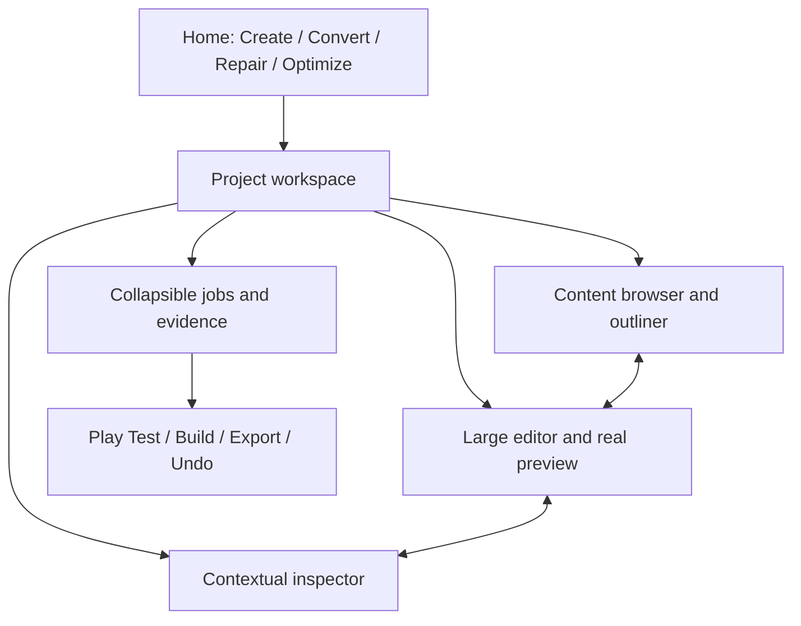

# Beautiful unified studio

[Home](Home.md) / [Checklist](Checklist.md) / [Architecture](Architecture.md) / [Ecosystem](Ecosystem.md) / [Source map](Source-Map.md)

> Welcoming on the surface; professional depth one click away.

### Four-action Home

[**UX-01**](Checklist.md#ux-01) - Create a Mod, Convert to Version, Repair / Fix Issues and Improve Performance are obvious production actions beside import/drop, useful empty states and real recent-project previews.

### One contextual workbench

[**UX-02**](Checklist.md#ux-02) - One Studio contains persistent resizable content tree/outliner, center viewport/editor, contextual inspector, timeline, source/debug panes and collapsible details; project types are contexts, not disconnected studios.

### Finished visual system

[**UX-03**](Checklist.md#ux-03) - Apply cohesive graphite/plum/amethyst and equally complete light/dark/system themes, readable typography, consistent icons/spacing/elevation/focus, purposeful motion and native window chrome across every screen.

### Discoverable contextual actions

[**UX-04**](Checklist.md#ux-04) - Global command palette, contextual search, shallow navigation, keyboard alternatives, accurate tooltips, meaningful next actions and exact deep links connect projects, mods, issues, configs, evidence and outputs.

### Honest progress and live findings

[**UX-05**](Checklist.md#ux-05) - Real stages/events, task graph, current action, per-item results, repair iterations and useful findings remain visible; logs are secondary and percentages never fabricate knowledge.

### Reliable editing and recovery

[**UX-06**](Checklist.md#ux-06) - Autosave, undo/redo, dirty-state indicators, snapshots, unsaved-change guards, conflict detection and restart restoration preserve selection, editor tabs, target and job state.

### Large-data and bulk usability

[**UX-07**](Checklist.md#ux-07) - Search, counts, filters, sorting, select-all, tagging and batch operations address the entire logical dataset; virtualized views do not cap results or drop errors.

### Accessible responsive native UI

[**UX-08**](Checklist.md#ux-08) - Verify both themes, contrast/focus/non-color status, screen-reader names, reduced motion, keyboard operation, specified desktop/portrait sizes and scaling without clipping primary actions.

### First-launch and update experience

[**UX-09**](Checklist.md#ux-09) - First launch provisions ordinary requirements with minimal questions; upgrades preserve projects/preferences/accounts/jobs; loading, empty, error and offline states remain actionable and polished.

### Real-user journey acceptance

[**UX-10**](Checklist.md#ux-10) - Exercise all four journeys in the actual package with clean inputs, real domain services, native runtime, persisted state and rollback; capture real screens, not mockups or generated showcase imagery.

**[Every linked source clause](Sources-UX.md)** / **[Source manifest](Source-Map.md)**

## The workspace, not a wall of text

| Region | What belongs here | What does not |
| :--- | :--- | :--- |
| Home | Four actions, import/drop, real recents, Continue | Raw checklists, logs, JSON or backend configuration forms |
| Left rail | Project content tree, outliner and contextual navigation | Separate disconnected studios for every file format |
| Center | Real model/texture/recipe/source/world editor and preview | Fake demo assets or generated runtime evidence |
| Right inspector | Selection properties, relationships and relevant actions | Global settings unrelated to the current work |
| Bottom tray | Jobs, errors, tests, timeline and expandable technical details | Persistent full-screen terminal output |

Keep **Favorites**, **Performance**, and the dedicated **Hotkeys** tab as first-class destinations. Preserve working Catalog, Source, Browser, Launcher and split/full views; connect them rather than cloning their state. Use deep graphite/plum, restrained amethyst, equally finished light/dark themes, readable controls, consistent spacing and short meaningful motion. Respect reduced motion; no decorative idle GPU loop.

**Acceptance budgets, not measured claims:** local click/cancel acknowledgement within 100 ms; warm local view within 200 ms; first indexed search result within 300 ms on the recorded baseline. Measure p95 with large real projects. Test all specified viewport sizes, both themes, keyboard-only use and high-DPI scaling. Screenshots show composition; actual interaction tests prove behavior.

## Detailed acceptance from your specifications

Every source task and binding clause has its own tracked entry, rather than disappearing into the heading above.

- [UX-01 - Four-action Home](Acceptance-UX.md#ux-01-details): 54 source details.
- [UX-02 - One contextual workbench](Acceptance-UX.md#ux-02-details): 14 source details.
- [UX-03 - Finished visual system](Acceptance-UX.md#ux-03-details): 6 source details.
- [UX-04 - Discoverable contextual actions](Acceptance-UX.md#ux-04-details): 8 source details.
- [UX-05 - Honest progress and live findings](Acceptance-UX.md#ux-05-details): 43 source details.
- [UX-06 - Reliable editing and recovery](Acceptance-UX.md#ux-06-details): 10 source details.
- [UX-07 - Large-data and bulk usability](Acceptance-UX.md#ux-07-details): 50 source details.
- [UX-08 - Accessible responsive native UI](Acceptance-UX.md#ux-08-details): 75 source details.
- [UX-09 - First-launch and update experience](Acceptance-UX.md#ux-09-details): 40 source details.
- [UX-10 - Real-user journey acceptance](Acceptance-UX.md#ux-10-details): 19 source details.
